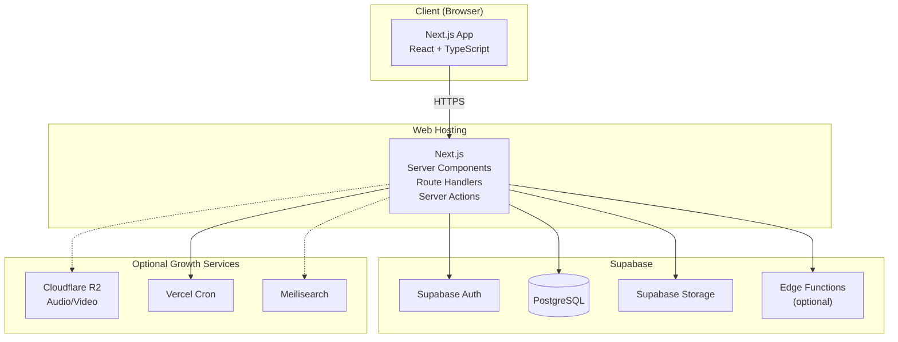

# Tech Stack & Architecture
## Benkyou Shimashou by ウィ (Wi)

---

## 1. Prinsip Pemilihan Stack

- **Sederhana untuk MVP, siap berkembang** — gunakan satu aplikasi utama Next.js sehingga frontend dan backend tidak perlu dipisah menjadi dua deployment.
- **Web-first, responsive** — satu codebase yang bekerja baik pada desktop dan mobile browser.
- **Konten-berat, bukan compute-berat** — optimalkan pembacaan materi, kosakata, kanji, audio, dan halaman belajar.
- **Minim infra yang harus dirawat** — database, autentikasi, dan object storage menggunakan layanan terkelola agar fokus pengembangan berada pada produk.
- **SRS harus reliabel** — algoritma penjadwalan review diisolasi sebagai service TypeScript dan diuji ketat.
- **Free-tier friendly** — arsitektur awal menghindari Redis, server background khusus, container production, dan monitoring stack yang belum diperlukan.

## 2. Ringkasan Stack

| Layer | Teknologi | Alasan |
|---|---|---|
| Full-stack Web | **Next.js + React + TypeScript (App Router)** | Frontend dan backend dalam satu aplikasi; mendukung Server Components, Route Handlers, dan deployment mudah |
| Styling/UI | **Tailwind CSS + shadcn/ui** | Cepat dikembangkan, konsisten, mudah dikustom untuk tema Jepang minimalis |
| State Management | **TanStack Query + Zustand** | TanStack Query untuk server state/cache; Zustand untuk state UI/client-only |
| Backend API | **Next.js Route Handlers + Server Actions** | Menghilangkan kebutuhan backend server terpisah pada MVP |
| Auth | **Supabase Auth** | Registrasi, login, session, password reset, dan OAuth tanpa membangun auth service sendiri |
| Database | **PostgreSQL via Supabase** | Relasional kuat untuk kurikulum, user progress, SRS, quiz, dan konten |
| Authorization | **PostgreSQL Row Level Security (RLS)** | Membatasi data berdasarkan `auth.uid()` langsung di database |
| Object Storage | **Supabase Storage** | Menyimpan audio, gambar, dan asset pembelajaran dengan integrasi langsung ke Supabase |
| CDN / Asset Lanjut | **Cloudflare R2 + CDN** (opsional) | Ditambahkan jika audio/video mulai membutuhkan storage dan egress lebih besar |
| Search | **PostgreSQL Full-Text Search** → Meilisearch (opsional) | Tidak membutuhkan service tambahan pada MVP |
| Background Jobs | **Vercel Cron / Supabase Edge Functions** (sesuai kebutuhan) | Untuk pekerjaan terjadwal ringan tanpa server worker permanen |
| Hosting Web | **Vercel** | Integrasi alami dengan Next.js dan deployment berbasis Git |
| Database/Auth/Storage | **Supabase** | Satu layanan terkelola untuk komponen backend utama |
| CI/CD | **GitHub Actions** | Lint, typecheck, test, dan quality checks otomatis |

> **Keputusan utama:** MVP menggunakan **Next.js + TypeScript sebagai full-stack application**, dengan **Supabase sebagai backend managed service**. Tidak ada ASP.NET Core backend terpisah pada arsitektur awal.

## 3. Arsitektur Sistem (High-Level)



### Alur data utama

1. Browser mengakses halaman Next.js.
2. Halaman publik yang membutuhkan SEO menggunakan Server Components.
3. Interaksi pengguna seperti review SRS, submit quiz, dan update progress menggunakan Route Handlers atau Server Actions.
4. Next.js berkomunikasi dengan Supabase menggunakan server-side client.
5. Supabase Auth menangani identitas dan session.
6. PostgreSQL menyimpan data kurikulum dan data user.
7. RLS memastikan query user hanya dapat mengakses data yang diizinkan.
8. Audio/gambar disimpan di Supabase Storage; R2 dapat ditambahkan jika kebutuhan asset meningkat.

## 4. Struktur Modul Backend Next.js

Karena tidak ada backend ASP.NET terpisah, business logic berada di dalam aplikasi Next.js dan harus tetap dipisahkan dari UI.

```text
apps/web/
 ├─ app/
 │   ├─ (auth)/login/
 │   ├─ (auth)/register/
 │   ├─ (dashboard)/dashboard/
 │   ├─ belajar/[level]/[jalur]/[unit]/[lesson]/
 │   ├─ review/
 │   ├─ latihan-soal/[level]/
 │   ├─ listening/[id]/
 │   ├─ api/
 │   │   └─ v1/
 │   │       ├─ auth/
 │   │       ├─ curriculum/
 │   │       ├─ vocabulary/
 │   │       ├─ kanji/
 │   │       ├─ grammar/
 │   │       ├─ listening/
 │   │       ├─ srs/
 │   │       ├─ quiz/
 │   │       └─ progress/
 │   └─ layout.tsx
 ├─ components/
 ├─ lib/
 │   ├─ supabase/
 │   │   ├─ client.ts
 │   │   └─ server.ts
 │   ├─ api/
 │   ├─ services/
 │   │   ├─ srs/
 │   │   ├─ quiz/
 │   │   ├─ progress/
 │   │   └─ curriculum/
 │   ├─ validations/
 │   └─ utils/
 ├─ hooks/
 ├─ store/
 ├─ types/
 └─ middleware.ts
```

### Aturan pemisahan

- `app/**/page.tsx`: composition dan rendering halaman.
- `app/api/**/route.ts`: HTTP boundary; validasi request, auth check, panggil service, format response.
- `lib/services/**`: business logic seperti SRS, quiz scoring, dan readiness score.
- `lib/supabase/**`: konfigurasi client Supabase.
- `lib/validations/**`: schema validation, misalnya Zod.
- `components/**`: UI dan interaksi.
- `hooks/**`: custom hooks, terutama integrasi TanStack Query.
- `store/**`: Zustand untuk state client-only.

## 5. Struktur Frontend (Next.js)

```text
apps/web/
 ├─ app/
 │   ├─ (auth)/login/
 │   ├─ (auth)/register/
 │   ├─ (dashboard)/dashboard/
 │   ├─ belajar/[level]/[jalur]/[unit]/[lesson]/
 │   ├─ review/
 │   ├─ latihan-soal/[level]/
 │   ├─ listening/[id]/
 │   └─ layout.tsx, page.tsx
 ├─ components/
 │   ├─ ui/
 │   ├─ curriculum/
 │   ├─ vocabulary/
 │   ├─ kanji/
 │   ├─ srs/
 │   ├─ quiz/
 │   └─ dashboard/
 ├─ hooks/
 │   ├─ use-srs-queue.ts
 │   ├─ use-submit-srs-answer.ts
 │   └─ use-dashboard.ts
 ├─ lib/
 │   ├─ supabase/
 │   ├─ api/
 │   ├─ services/
 │   ├─ validations/
 │   └─ srs/
 ├─ store/
 └─ types/
```

## 6. Keputusan Arsitektur Kunci

1. **Full-stack Next.js** — frontend dan backend API berada dalam satu aplikasi.
2. **Supabase sebagai managed backend** — PostgreSQL, Auth, dan Storage tidak perlu dibangun/dirawat sendiri.
3. **RLS sebagai lapisan authorization database** — data user seperti review card, progress, dan quiz session wajib dilindungi berdasarkan user ID.
4. **API-first tetap dipertahankan** — Route Handlers menggunakan kontrak REST yang terdokumentasi sehingga frontend tetap memiliki boundary yang jelas.
5. **SRS Engine sebagai service terisolasi** — algoritma FSRS/SM-2 tidak ditaruh langsung di Route Handler atau komponen React.
6. **Track Shiken vs Seikatsu sebagai atribut** — gunakan `track` (`shiken` | `seikatsu` | `both`) untuk cross-reference.
7. **Asset di object storage** — audio/gambar tidak disimpan sebagai binary di tabel PostgreSQL.
8. **Redis belum digunakan pada MVP** — query PostgreSQL dan index yang tepat cukup untuk antrean SRS awal. Redis dapat ditambahkan bila profiling menunjukkan kebutuhan nyata.
9. **Background worker permanen belum digunakan** — pekerjaan terjadwal ringan menggunakan Vercel Cron atau Edge Functions bila diperlukan.
10. **Search dimulai dari PostgreSQL FTS** — Meilisearch hanya ditambahkan jika kebutuhan pencarian berkembang.

## 7. Lingkungan (Environments)

| Environment | Tujuan | Implementasi |
|---|---|---|
| `local` | Development harian | Next.js lokal + Supabase project/development environment |
| `preview` | Review setiap branch/PR | Vercel Preview Deployment |
| `production` | Pengguna nyata | Vercel + Supabase production project |

> Docker tetap boleh digunakan untuk development atau tooling tertentu, tetapi **bukan dependency wajib untuk menjalankan MVP production**.

## 8. Keamanan

- HTTPS wajib pada deployment non-local.
- Authentication ditangani Supabase Auth.
- Session dikelola menggunakan mekanisme session Supabase; jangan membuat sistem refresh token custom jika tidak diperlukan.
- Data user wajib dilindungi PostgreSQL RLS.
- Validasi request menggunakan schema validation (mis. Zod) sebelum business logic dijalankan.
- Authorization dilakukan server-side; jangan mempercayai `userId` yang dikirim client.
- Rate limiting diterapkan pada endpoint sensitif seperti login, submit quiz, dan endpoint yang berpotensi disalahgunakan. Mekanisme dapat menggunakan layanan edge/middleware atau solusi tambahan saat kebutuhan meningkat.
- Secret hanya disimpan pada environment variables Vercel/Supabase, bukan di repository.
- Backup database mengikuti kemampuan backup Supabase pada environment production.

## 9. Strategi Scaling

### Tahap MVP

```text
Vercel
  └─ Next.js
       └─ Supabase
            ├─ Auth
            ├─ PostgreSQL
            └─ Storage
```

### Tahap pertumbuhan

Jika traffic atau asset meningkat, komponen dapat ditambahkan secara bertahap:

```text
Vercel / Next.js
 ├─ Supabase PostgreSQL
 ├─ Supabase Auth
 ├─ Supabase Storage
 ├─ Cloudflare R2 (audio/video besar)
 ├─ Redis (cache jika terbukti perlu)
 ├─ Meilisearch (jika FTS tidak lagi cukup)
 └─ Worker/Edge Functions (background processing lebih berat)
```

Prinsipnya: **tambahkan infra berdasarkan bottleneck nyata, bukan sejak awal**.
