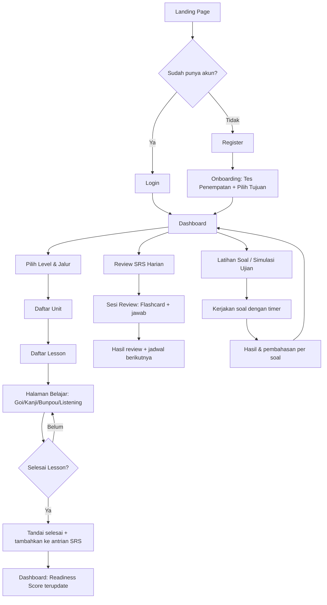

# Component Tree & UI Flow
## Benkyou Shimashou by ウィ (Wi)

---

## 1. Peta Halaman (Sitemap)

```
/                          → Landing page
/login, /register          → Autentikasi
/onboarding                → Tes penempatan level awal (opsional) + pilih tujuan (JLPT / Kehidupan / Keduanya)
/dashboard                 → Ringkasan progress, readiness score, CTA lanjut belajar
/belajar
  /belajar/[level]                         → Overview level (N5..N1), pilih jalur
  /belajar/[level]/[jalur]                 → Daftar Unit (Shiken Michi / Seikatsu Michi)
  /belajar/[level]/[jalur]/[unit]          → Daftar Lesson dalam unit
  /belajar/[level]/[jalur]/[unit]/[lesson] → Halaman belajar (goi/kanji/bunpou/listening)
/review                     → Sesi review SRS harian
/latihan-soal
  /latihan-soal/[level]                    → Pilih jenis mondai (moji-goi/bunpou/dokkai/choukai) / simulasi ujian penuh
  /latihan-soal/[level]/sesi/[sessionId]   → Halaman pengerjaan soal
  /latihan-soal/[level]/hasil/[sessionId]  → Hasil & pembahasan
/listening/[id]              → Pemutar audio otentik + transkrip + anotasi
/kamus                       → Pencarian kosakata/kanji lintas level
/profil                      → Pengaturan akun, preferensi bahasa, notifikasi
```

## 2. Diagram Alur Pengguna Utama (User Flow)



## 3. Component Tree — Halaman Belajar (Lesson Page)

```
LessonPage
 ├─ LessonHeader (judul lesson, breadcrumb Level>Jalur>Unit>Lesson, progress bar)
 ├─ LessonTabs (Kosakata | Kanji | Tata Bahasa | Listening | Latihan Mini)
 │
 ├─ [Tab: Kosakata]
 │    └─ VocabList
 │         └─ VocabCard (× n)
 │              ├─ KanjiFurigana
 │              ├─ AudioPlayButton
 │              ├─ MeaningBlock (arti ID)
 │              ├─ ContextTagBadge[] (formal/kasual/slang/dll)
 │              ├─ ExampleSentence
 │              └─ MnemonicBox (toggle expand)
 │
 ├─ [Tab: Kanji]
 │    └─ KanjiGrid
 │         └─ KanjiCard (× n)
 │              ├─ KanjiStrokeAnimation
 │              ├─ ReadingList (on'yomi/kun'yomi)
 │              ├─ RadicalBreakdown
 │              └─ RelatedWords
 │
 ├─ [Tab: Tata Bahasa]
 │    └─ GrammarPointList
 │         └─ GrammarCard (× n)
 │              ├─ PatternFormula
 │              ├─ FormalVsCasualCompare  (khusus jalur Seikatsu / cross-ref)
 │              └─ ExampleSentenceList
 │
 ├─ [Tab: Listening]
 │    └─ ListeningEmbed
 │         ├─ AudioPlayer
 │         ├─ TranscriptPanel (toggle furigana)
 │         └─ AnnotationList (ungkapan non-JLPT yang ditandai)
 │
 ├─ [Tab: Latihan Mini]
 │    └─ MiniQuiz
 │         └─ QuizQuestion (× n)
 │
 └─ LessonFooterNav (Lesson sebelumnya / selanjutnya, tombol "Tandai Selesai")
```

## 4. Component Tree — Sesi Review SRS

```
ReviewSessionPage
 ├─ ReviewProgressBar (n/total kartu hari ini)
 ├─ ReviewCard
 │    ├─ PromptSide (kanji/goi/kanji-reading — tergantung tipe kartu)
 │    ├─ RevealAnswerButton
 │    ├─ AnswerSide (arti, contoh, audio)
 │    └─ SelfRatingButtons ("Lupa" | "Sulit" | "Bisa" | "Mudah") → kirim ke SRS Engine
 └─ ReviewSessionSummary (muncul setelah kartu terakhir)
      ├─ StatsRecap (jumlah benar/salah, waktu total)
      └─ NextReviewPreview (jadwal review berikutnya)
```

## 5. Component Tree — Dashboard

```
DashboardPage
 ├─ WelcomeHeader (sapaan, streak counter)
 ├─ ReadinessGaugeGroup
 │    ├─ ExamReadinessGauge (per level aktif)
 │    └─ LifeFluencyGauge
 ├─ ContinueLearningCard (CTA lanjut lesson terakhir)
 ├─ TodayReviewCard (jumlah kartu SRS jatuh tempo hari ini, CTA ke /review)
 ├─ StreakCalendar (heatmap aktivitas harian)
 ├─ ProgressChart (grafik penguasaan kosakata/kanji per unit, via recharts)
 └─ RecommendedNextUnit (rekomendasi unit berikutnya)
```

## 6. Komponen Bersama (Shared/UI Primitives)

```
components/ui/
 ├─ Button, Badge, Card, Tabs, Dialog, Tooltip, Progress, Skeleton (shadcn/ui base)
 ├─ FuriganaText        (render teks dengan toggle furigana on/off)
 ├─ AudioPlayButton      (ikon speaker + play state, reusable di semua kartu)
 ├─ ContextTagBadge      (badge warna per tag: formal=biru, kasual=hijau, slang=oranye, dst)
 └─ LevelBadge           (badge N5..N1 dengan warna berbeda tiap level)
```

## 7. Prinsip UI/UX

- **Dua warna identitas jalur**: Shiken Michi (biru — asosiasi formal/akademis) vs Seikatsu Michi (hijau/oranye — asosiasi hangat/hidup sehari-hari), konsisten di seluruh badge & progress bar.
- **Toggle furigana global** tersimpan di preferensi pengguna (Zustand + persist ke profil).
- **Mobile-first untuk sesi review** — sesi SRS harus nyaman dipakai satu tangan di HP (swipe untuk rating jawaban, opsional).
- **Micro-feedback** — animasi ringan saat kartu ditandai selesai / lesson completed, mendukung motivasi tanpa berlebihan.
- **Aksesibilitas font Jepang** — ukuran font kanji minimal 20px di mobile agar mudah dibaca, dengan opsi perbesar.
