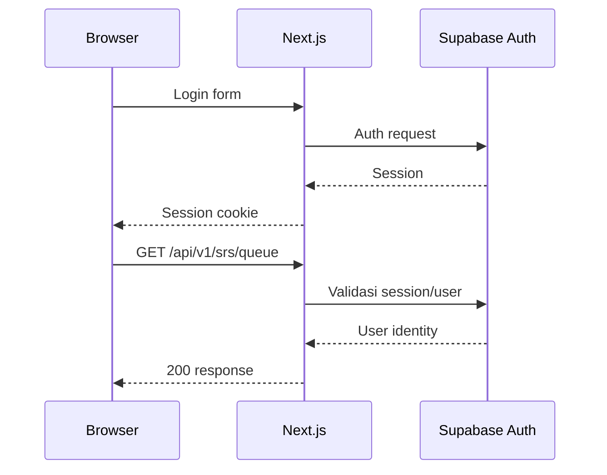

# API / Data Fetching Specs
## Benkyou Shimashou by ウィ (Wi)

**Versi:** 2.0
**Terkait:** 02-TECH-STACK-ARCHITECTURE.md, 03-COMPONENT-TREE-UI-FLOW.md

---

## 1. Prinsip Umum

- **API-first & typed** — Route Handlers Next.js menjadi HTTP boundary. Schema request/response didefinisikan dengan TypeScript + Zod; kontrak OpenAPI dapat digenerate dari schema tersebut bila dokumentasi API diperlukan.
- **REST, resource-oriented** — endpoint menggunakan noun/resource. Aksi non-CRUD memakai sub-resource/action yang jelas seperti `POST /lessons/{lessonId}/complete`.
- **Same-origin first** — frontend dan API berada dalam aplikasi Next.js yang sama, sehingga browser terutama menggunakan session cookie Supabase, bukan mengelola access/refresh token custom.
- **Predictable & consistent** — endpoint mengikuti amplop respons, error code, paging, dan validasi yang konsisten.
- **Server-side authorization** — identitas pengguna diambil dari session Supabase pada server; jangan menerima `userId` sebagai sumber kebenaran dari client.
- **Cache-aware** — konten kurikulum jarang berubah dan dapat di-cache lebih lama; data SRS, progress, dan session quiz bersifat user-specific dan harus lebih fresh.

---

## 2. Konvensi URL & Versioning

Pada production, API berada di origin yang sama dengan aplikasi:

```text
local      → http://localhost:3000/api/v1
preview    → https://<vercel-preview>/api/v1
production → https://<domain>/api/v1
```

- Versi dinyatakan di path: `/api/v1/...`.
- Breaking change → gunakan `/api/v2/...`; jangan merusak kontrak v1 yang masih digunakan.
- Resource path selalu plural dan lowercase/kebab-case:
  ```text
  /vocabulary-items
  /grammar-points
  /quiz/sessions
  ```
- Nested resource maksimal dua level jika tidak membuat URL sulit dipahami:
  ```text
  GET /levels/{level}/units
  GET /units/{unitId}/lessons
  GET /lessons/{lessonId}
  ```
- Filter, sorting, dan paging menggunakan query parameter.

---

## 3. Auth & Header Wajib

### 3.1 Browser Request

Untuk request browser ke Next.js API pada origin yang sama:

| Header | Wajib | Keterangan |
|---|---|---|
| `Content-Type: application/json` | Ya untuk body JSON | Tidak perlu untuk GET tanpa body |
| `Accept-Language: id` | Opsional | Default Bahasa Indonesia |
| `X-Client-Version` | Opsional | Versi frontend untuk debugging |
| Session cookie Supabase | Untuk endpoint protected | Dikelola oleh Supabase, bukan custom refresh-token code |

Server mendapatkan user melalui Supabase server client/session.

### 3.2 Server-to-server Request

Jika suatu saat terdapat worker, Edge Function, atau service eksternal, autentikasi service-to-service dapat menggunakan secret/token yang disimpan di environment variable. Jangan mengekspos service-role key ke browser.

### 3.3 Auth Flow



- Jangan membuat endpoint `/auth/refresh` custom untuk MVP.
- Password reset, email verification, OAuth, dan session lifecycle menggunakan Supabase Auth.
- `userId` yang digunakan untuk query data user berasal dari identity/session server-side.

---

## 4. Amplop Respons Standar

### 4.1 Sukses

```json
{
  "success": true,
  "data": { "...": "..." },
  "meta": {
    "page": 1,
    "pageSize": 20,
    "totalItems": 143,
    "totalPages": 8
  }
}
```

`meta` hanya digunakan untuk endpoint list/paginated.

### 4.2 Error

```json
{
  "success": false,
  "error": {
    "code": "SRS_QUEUE_EMPTY",
    "message": "Tidak ada kartu review yang jatuh tempo hari ini.",
    "details": null,
    "traceId": "request-id"
  }
}
```

- `code` adalah identifier machine-readable dengan format `SCREAMING_SNAKE_CASE`.
- `message` adalah fallback tampilan; logic frontend menggunakan `error.code`.
- `traceId` digunakan untuk menghubungkan error dengan log deployment/observability.
- Validasi field-level memakai format:

```json
"details": [
  { "field": "email", "message": "Format email tidak valid" }
]
```

### 4.3 Pemetaan HTTP Status

| Status | Kapan dipakai |
|---|---|
| 200 | GET/PUT/PATCH/aksi berhasil |
| 201 | POST membuat resource baru |
| 204 | DELETE/aksi berhasil tanpa body |
| 400 | Request/schema validation gagal |
| 401 | Session tidak ada atau tidak valid |
| 403 | User valid tetapi tidak memiliki hak akses |
| 404 | Resource tidak ditemukan |
| 409 | Konflik state, misalnya quiz sudah disubmit |
| 422 | Request valid secara schema tetapi melanggar business rule |
| 429 | Rate limit terlampaui |
| 500 | Unhandled server error |

---

## 5. Paging, Sorting, Filtering

- Default: `page=1`, `pageSize=20`.
- `pageSize` maksimal 100.
- Sort hanya boleh menggunakan kolom yang di-whitelist oleh endpoint.
- Filter eksplisit lebih disukai daripada filter bebas:

```text
GET /api/v1/vocabulary-items?level=N4&track=shiken&unitId=...&search=konbini&page=1&pageSize=20
```

- Query yang membutuhkan user identity tetap mengambil user dari session, bukan query parameter.

---

## 6. Ringkasan Endpoint per Modul

> Implementasi endpoint berada di `app/api/v1/**/route.ts`. Business logic berada di `lib/services/**`, bukan langsung di Route Handler.

### 6.1 Auth

Supabase Auth menangani sebagian besar authentication flow. Route internal hanya dibuat untuk kebutuhan profile/session aplikasi:

```text
GET    /auth/me
PATCH  /auth/profile
```

Login/register/logout/password reset tidak perlu dibuat ulang sebagai custom JWT service.

### 6.2 Kurikulum

```text
GET    /levels
GET    /levels/{level}
GET    /levels/{level}/tracks/{track}/units
GET    /units/{unitId}/lessons
GET    /lessons/{lessonId}
```

### 6.3 Kosakata

```text
GET    /vocabulary-items?level=&track=&unitId=&tag=&search=&page=
GET    /vocabulary-items/{id}
```

### 6.4 Kanji

```text
GET    /kanji?level=&search=&page=
GET    /kanji/{id}
GET    /kanji/{id}/related-words
```

### 6.5 Tata Bahasa

```text
GET    /grammar-points?level=&track=&unitId=
GET    /grammar-points/{id}
```

### 6.6 Listening

```text
GET    /listening/{id}
GET    /listening/{id}/transcript
GET    /listening/{id}/annotations
```

URL asset audio dikembalikan oleh server/storage layer; frontend tidak menyusun path bucket secara manual.

### 6.7 SRS

```text
GET    /srs/queue
POST   /srs/queue/{cardId}/answer
GET    /srs/summary/today
```

Queue dihitung/query dari PostgreSQL pada MVP. Redis tidak menjadi dependency awal.

### 6.8 Latihan Soal

```text
GET    /quiz/{level}/types
POST   /quiz/{level}/sessions
POST   /quiz/sessions/{sessionId}/answers
POST   /quiz/sessions/{sessionId}/submit
GET    /quiz/sessions/{sessionId}/result
```

### 6.9 Progress & Dashboard

```text
GET    /progress/dashboard
GET    /progress/readiness/{level}
GET    /progress/streak-calendar?month=
POST   /lessons/{lessonId}/complete
```

### 6.10 Kamus

```text
GET    /kamus/search?q=&type=vocab|kanji
```

---

## 7. Contoh Kontrak — Endpoint Kunci

### 7.1 `GET /api/v1/srs/queue`

```json
{
  "success": true,
  "data": {
    "totalDue": 24,
    "cards": [
      {
        "cardId": "c_8f2a...",
        "itemType": "vocab",
        "itemId": "v_1029",
        "promptSide": {
          "kanji": "先生",
          "furigana": "せんせい"
        },
        "dueAt": "2026-09-03T00:00:00Z"
      }
    ]
  }
}
```

### 7.2 `POST /api/v1/srs/queue/{cardId}/answer`

Request:

```json
{
  "rating": "bisa",
  "responseTimeMs": 3200
}
```

Response:

```json
{
  "success": true,
  "data": {
    "cardId": "c_8f2a...",
    "nextDueAt": "2026-09-06T00:00:00Z",
    "newInterval": 3
  }
}
```

> Nilai seperti `easeFactor` tidak wajib diekspos jika algoritma SRS yang dipakai tidak membutuhkannya sebagai konsep publik API. Detail internal scheduler tetap menjadi concern service.

### 7.3 `POST /api/v1/quiz/sessions/{sessionId}/submit`

```json
{
  "success": true,
  "data": {
    "sessionId": "qs_991",
    "score": 78,
    "correctCount": 39,
    "totalCount": 50,
    "durationSeconds": 1620,
    "breakdown": [
      { "section": "moji-goi", "correct": 18, "total": 20 },
      { "section": "bunpou-dokkai", "correct": 15, "total": 20 },
      { "section": "choukai", "correct": 6, "total": 10 }
    ]
  }
}
```

---

## 8. Strategi Data Fetching di Frontend

### 8.1 Pembagian Tanggung Jawab

| Concern | Tool |
|---|---|
| Server state, cache, refetch, mutation | **TanStack Query** |
| Client-only UI state | **Zustand** |
| Schema validation | **Zod** |
| API types | **TypeScript types dari schema/kontrak API** |
| Auth/session | **Supabase Auth + server client** |

### 8.2 Struktur API Client

```text
lib/api/
 ├─ client.ts
 ├─ curriculum.ts
 ├─ vocabulary.ts
 ├─ kanji.ts
 ├─ grammar.ts
 ├─ listening.ts
 ├─ srs.ts
 ├─ quiz.ts
 └─ progress.ts
```

`client.ts` bertugas untuk:

- memanggil `/api/v1/...`;
- parse JSON;
- memvalidasi response bila diperlukan;
- mengubah error API menjadi `ApiError` yang konsisten.

Tidak ada interceptor refresh-token custom.

### 8.3 Konvensi Query Key (TanStack Query)

```ts
export const qk = {
  curriculum: {
    levels: () => ['curriculum', 'levels'] as const,
    units: (level: string, track: Track) =>
      ['curriculum', 'units', level, track] as const,
    lesson: (lessonId: string) =>
      ['curriculum', 'lesson', lessonId] as const,
  },
  srs: {
    queue: () => ['srs', 'queue'] as const,
  },
  dashboard: () => ['dashboard'] as const,
};
```

Mutation SRS setelah sukses meng-invalidasi queue dan dashboard terkait.

### 8.4 `staleTime` per Kategori Data

| Kategori | staleTime | Alasan |
|---|---|---|
| Kurikulum/content | 30 menit – `Infinity` untuk data immutable | Jarang berubah |
| SRS queue | 0 | Harus fresh selama sesi review |
| Dashboard/readiness | sekitar 1 menit | Fresh tanpa polling agresif |
| Quiz session aktif | 0, refetch manual | Hindari race condition |
| Kamus search | sekitar 5 menit | Query yang sama dapat digunakan ulang |

### 8.5 Pola Hook per Domain

```ts
export function useSrsQueue() {
  return useQuery({
    queryKey: qk.srs.queue(),
    queryFn: api.srs.getQueue,
    staleTime: 0,
  });
}

export function useSubmitSrsAnswer() {
  const qc = useQueryClient();

  return useMutation({
    mutationFn: api.srs.submitAnswer,
    onSuccess: () => {
      qc.invalidateQueries({ queryKey: qk.srs.queue() });
      qc.invalidateQueries({ queryKey: qk.dashboard() });
    },
  });
}
```

Komponen UI tidak memanggil `fetch()` langsung jika domain tersebut sudah memiliki API module/hook.

### 8.6 Prefetching

- Lesson page dapat mem-prefetch data tab berikutnya saat idle.
- Dashboard dapat mem-prefetch SRS queue ketika user mengarahkan pointer ke CTA review.
- Jangan melakukan prefetch besar-besaran untuk semua level; hanya data yang kemungkinan segera digunakan.

### 8.7 Aset Statis

- Asset audio/gambar disimpan di Supabase Storage pada MVP.
- URL asset berasal dari storage layer dan tidak dirakit manual di komponen.
- Jika file tertentu perlu akses terbatas, gunakan signed URL.
- `AudioPlayButton` memakai `<audio preload="none">` kecuali ada alasan UX untuk preload.
- Cloudflare R2 dapat ditambahkan kemudian jika volume audio/video membuat storage/egress Supabase tidak lagi ideal.

### 8.8 Error Handling di UI

| Error | Perilaku FE |
|---|---|
| 401 | Tampilkan state session berakhir dan arahkan login |
| 403 | Tampilkan "Konten terkunci" |
| 404 | Tampilkan halaman/empty state khusus |
| 409 | Tampilkan konflik state dan refresh resource bila relevan |
| 422 | Tampilkan business-rule message berdasarkan `error.code` |
| 429 | Tampilkan pesan rate limit dan retry setelah waktu yang sesuai |
| 500/network | Error boundary atau retry dengan pesan yang jelas |

### 8.9 Server Component vs Client Component

- **Server Component** untuk halaman publik/read-heavy dan data yang tidak memerlukan interaksi client.
- **Client Component + TanStack Query** untuk SRS, quiz, dashboard interaktif, dan state yang berubah selama sesi.
- Server dapat memanggil service/data access secara langsung tanpa memutar melalui HTTP internal jika tidak ada kebutuhan API boundary.
- Route Handler dipakai ketika data/aksi memang perlu menjadi endpoint HTTP yang reusable oleh client.

---

## 9. Rate Limiting & Keamanan Data Fetching

- Endpoint sensitif seperti auth callback, submit quiz, dan submit SRS harus memiliki rate limiting.
- MVP tidak bergantung pada Redis hanya untuk rate limiting. Gunakan mekanisme rate limiting di layer deployment/edge atau implementasi ringan yang sesuai dengan platform.
- Jika kebutuhan rate limiting terdistribusi meningkat, Redis/Upstash dapat ditambahkan sebagai layanan terpisah.
- Semua query data user wajib di-scope berdasarkan authenticated user ID.
- PostgreSQL RLS menjadi lapisan pertahanan tambahan untuk tabel user-owned.
- Jangan pernah mengekspos Supabase `service_role` key ke client.
- Jangan memasukkan token, password, atau secret ke response API/log.
